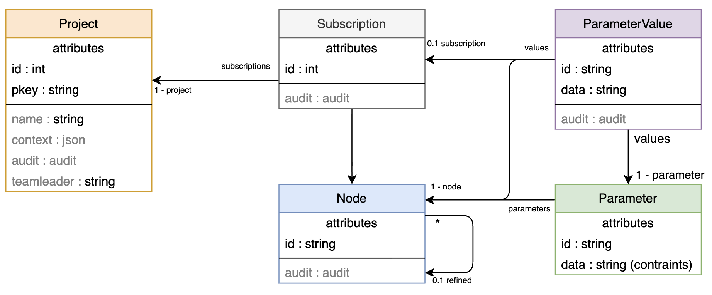

# Architecture


# Key features
The backend container assumes the business role of the application, is stateless, scalable and based on intensive convention over configuration design.

## Relevant stack parts
* Java9
* Spring 5 baseline : -core, -security and -data
* CXF, not Spring-WS
* JPA 2

# Philosophy
The main ideas are Convention over Configuration and modularity. 

## Convention over Configuration
There is a default behaviour based on the convention, but it's always possible to override it.

## REST Endpoint
By convention, the [status code](https://en.wikipedia.org/wiki/List_of_HTTP_status_codes) is determined for you (200, 204, 400, ...) and follow the best practices.
## Exception handling
You could never use "try catch" statements in your application. Let the error reaching the filters that will generate the status code and REST payload for you. More details there [[Exception handling]].

## Validation handling
Implicit validation management is proceed before the REST controller is actually called. Properties mapping, types, and BVAL constraints are managed for you. This avoids a lot of useless code and tests. More details there [[Jackson Ext]] and [[CXF Ext]].

## Entity equals/hashcode
No `equals` or `hashcode` are required. The design above Spring-Data implies these methods are not required to build a consistant cache for Hibernate.

## getter/setter
Thanks to [Lombok](http://projectlombok.org/), dont't write anymore `getX` and `setX`.

## Basic ORM operations
Thanks to [Spring Data](https://projects.spring.io/spring-data-jpa/), basic operations such as `findAll` or `findOne` are available at zero cost. In addition, some operations have been added (`findAllBy`, `findOneExpected`, ...), see [[Spring-Data Ext]]

## Database mapping
JPA to DDL generation is backed by Hibernate. We have added conventional `ManyToOne` column naming ensuring the proper compatibility with constraints (`@Unique`,...), case (in)sensitive databases and exception handling. More details there [[Hibernate Ext]].

## Security over REST
With REST, comes some conventional meaning of `GET`, `POST`,... methods. The integrated RBAC security layer make easy dynamical security configuration.

## Modularity
Split your code to make micro-services grid. Instead of having a global configuration file (XML, YML,...), a centralized Spring-Boot java configuration, or some useless code to write to register your features.

## Cache
With Hazelcast, even with [Spring-Boot](https://docs.spring.io/spring-boot/docs/current/reference/html/boot-features-hazelcast.html) you cannot easily split your `CacheConfig`. We have built a merged configuration that collects the available `CacheConfig` to register them for to the `HazelcastInstance`. More details there [[Hibernate Ext]].

## JPA
JPA specification requires that your `orm.xml` comes along your entities, even with `package` auto-discovery classes. But in a modular application, it's not possible to anticipate the entities you'll get in the classpath. More details there [[Hibernate Ext]].

# Features

## Editing Data pivot (CSV)

```java
@Autowired
private CsvForJpa csvForJpa;
...
csvForJpa.insert("csv", Entity.class);
```
See `CsvForJpa.java`

### Description
Maintaining data for the tests may be a pain. The actual solutions are:
* external data stored as a dump: hard to update, to manipulate data and to handle the generated identifier
* fully coded in the tests with some `em.persist(..)` in the JUnit: the more data, the more amount of code, no global view of the data. On the other side, you gain a strongly typed dataset. 

In addition of these solution, come the CSV format:
* CSV is common, compact (more than JSON), and easy to handle: filtering, ordering, etc. with you favorite Excel like editor
* Mostly all database editors support import or export in CSV format
* CSV parsing and generation are fast and simple and do not involve very much libraries

The CSV format is not mandatory for your data, there is a built-in integration. 

### Sample
Test classe
```java
public class MyTest {
  @Autowired
  private CsvForJpa csvForJpa;
  public @Test void test() {
    csvForJpa.insert("csv", PublicProfile.class, Person.class);
    // Data is now in my base
  }
}
```
Entities
```java
public @Entity @Getter @Setter class PublicProfile {
  private @Id String id;
  private Date since;
}
public @Entity @Getter @Setter class Person extends AbstractPersistable<Integer> {
  private String firstName;
  private String lastName;
  private Integer age;
  private @ManyToOne PublicProfile profile;
}
```

CSV files `public-profile.csv`, `publicprofile.csv ` are accepted
```csv
jdoe;2018-04-01
jdoe2;12/08/2012
henry;2018-01-04T09:23:45.017+01:00
alpha
```
`person.csv`
```csv
John;Doe;21;jdoe
Jane;Doe;21;jdoe2
Marc;;23
Henry;;henry
```

This will read the file `csv/person.csv` and will persist one entry per row in `MyEntity` JPA entity. Then will do the same for `csv/public-profile.csv`.

### More complexe usage
Many options are available: separator, encoding and headers.

As a CSV file contains only data of one entity, it could be difficult to handle the relation between two entities. In the previous sample, the relationship was conventional with `id` property, and the order was following the filds declaration order. For a more complexe usage, header must be explicitly defined

Entities
```java
public @Entity @Getter @Setter class PublicProfile AbstractPersistable<Integer> {
  private String displayName;
}
public @Entity @Getter @Setter class PrivateProfile {
  private @Id String login;
  private String mail;
}
public @Entity @Getter @Setter class Person extends AbstractPersistable<Integer> {
  private String firstName;
  private String lastName;
  private Integer age;
  private @ManyToOne PrivateProfile publicProfile;
  private @ManyToOne PublicProfile privateProfile;
  private @ManyToOne PublicProfile friendProfile;
}
```

CSV files `public-profile.csv`
```csv
displayName
jdoe
jdoe2
```
`private-profile.csv`
```csv
login;mail
login1;john.doe@sample.com
login2;jane.doe@other.com
```
`person.csv`
```csv
firstName;lastName;age;publicProfile.displayName;privateProfile.mail;friendProfile.id!
John;Doe;21;jdoe;john.doe@sample.com;1
Jane;Doe;21;jdoe2;jane.doe@other.com;2
```

### Code sheets
* Order matters: 
  * Inside the CSV, a row can reference itself and or a previous one
  * Since an entity can refer to another one, the `class` parameters must follow this relationship
* Date formats: `yyyy-MM-dd'T'HH:mm:ssZ`, `yyyy-MM-dd'T'HH:mm:ss.SSSXXX`, `yyyy/MM/dd`, `dd/MM/yyyy` and optional `HH:mm`, `HH:mm:ss` and `/` or `-` separator variants.
* Header format: `jpaProperty(.joinProperty)?!?`
  * `jpaProperty`: Raw value, date, enumeration value (case insensitive),...
  * `jpaProperty.joinProperty`: Join property. Implies a `SELECT * FROM JoinEntity WHERE joinProperty = :value`
  * `jpaProperty.generatedId!`: Join to a generated `@Id` property/ Implies a `SELECT * FROM JoinEntity` and then select the n-th raw. These way, you can join the table by its generated incremented identifier.
* `CsvForJpa#insert(..)` insert the entries without deleting the previous ones.
* `CsvForJpa#reset(..)` will delete all previous JPA entries in the reversed `classes` order, and then will insert the JPA entries from the CSV.
* `CsvForJpa#cleanup(..)` will delete all previous JPA entries in the reversed `classes` order.
* `CsvForJpa#toJpa(..)` will only return the corresponding JPA entries.

## Security


This topic is talking about [O]RBAC mechanism implemented in this application. This is the far most complex feature.

The ordered implied security levels:
* Authentication check be on of the enabled authentication providers
* [URL access granted by static configuration](#url-access-granted-by-static-configuration)
* [URL access granted by RBAC](#url-access-granted-by-rbac)
* [Resource access](#resource-access) granted by ORBAC
* Organization Role Based Access Control are related to identity plugins derived from [ligoj/plugin-id](https://github.com/ligoj/plugin-id). These plug-ins map user from a repository like LDAP to groups and permissions.

All work with a `deny all` by default.

### Vocabulary

Many terms are used in this documentations and the definitions will make the lighter further explanations: 
* User: a user defined in the IAM system
* Principal: The current authenticated user.
* Credentials: A set a information proving the identity of the principal.
* Role: Simple logical name aggregating authorizations. Unauthenticated users have the `ROLE_ANONYMOUS` role
* Role Assignment: A role associated to a user. A user can have any amount of role. The role `USER` (even if it is not defined) is granted to any authenticated user.
* System Administrator: A principal user having an `api` authorization with the `.*` pattern.
* Group: A set of users of users. A group can be within another groups. A user can be member of any number of groups. Note that a group may not be empty depending on the underlining IAM provider, but a virtual and invisible user may be kept for empty groups.
* Company: A set of users. A company can be within another a single company. A user is member of exactly one company.
* Container: Company or group.
* Container scope: A logical LDAP like sub-tree to calssify a container. At creation time of a container, this scope ensures the container is created in the correct hierarchy. At read time, it is used to display the containers by adding logical type to them.
* Node: A service, tool or tool instance, see the Subscription documentation.
* Tree: An abstract hierarchical path. (to-do) A bit difficult to explain for now...
* Resource: Container, user, node or a tree.
* Delegate: Is a read permission given to a receiver for a container.
  * A receiver can be any resource. The delegate receiver's type is either "USER", "GROUP" or "COMPANY".
  * There is a "write" flag allowing to write in this container.
  * There is also a "admin" flag allowing to the receiver to share this delegate to another visible resource.
* Project: A team owning a set of subscriptions, see the Subscription documentation
* Project leader: The main contact of the project, and default manager of the project
* Hook: A script executed when a specific event occurs.

### Authorization

An access to URLs and having the following properties:
* method:  `GET`, `POST`, `PUT`, `DELETE` or _ `null`_ for all of them. Defined the HTTP method enabling this authorization.
* pattern: Regular expression of the URL to match:
  * `.*`: any URL
  * `^rest/.*`: any REST URL
  * `^rest/my-resource/\d+`: access to `my-resource` by their identifier only.
* type: 
  * `ui`: This authorization is based on the fragment part of the URL
  * `api`: The URL corresponds to a REST access. The matched URL starts with the path without the context and includes the query parameters.

### How it works ?

The authentication is first implied. The built-in authentication feature is based on `x-api-key` and `x-api-user` headers or parameters.
When both are provided, they are checked. When only `x-api-user` or `x-api-key` is provided, they are ignored.


The `api` authorization is checked at server side for each REST access, and is partially used at browser side.  

The `ui` authorization is based on the fragment part of the URL, so only checked by the browser. This is not really a security, and is only relevant to disable, hide or remove the UI component the principal should not see. You may notice this kind of authorization could be overridden by the user at the browser side. As base practices, this kind of authorization **must** be associated to a corresponding `api` authorization.

The `ui` security can be avoided by the user when he/she requests separately each JavaScript/CSS/HTML,... static resources, but the data are guarded by the `api` authorizations.

### At browser side

When the user profile is loaded, the authorizations (`ui` and `api`) are checked in the current DOM for the first load and then continuously when it is updated.  
The watched components are :
- The current browser's URL itself: the `location`, visible in the navigation URL. When it is unauthorized, a security message is displayed, and the content is not loaded.
- The HTML components having `href` attribute
- The HTML components having `data-secured-service`, `data-secured-role` or `data-secured-method` attribute. See [data-secured-*](#data-secured-)

The matched URL starts after the `#/` fragment part. Samples:
    * `^system/bench`: Browser URL `#/system/bench`
    * `^system/.*`: Browser URL `#/system`

When a HTML component is unauthorized, by default its removed from the DOM. It is possible to control this behavior with `data-security-on-forbidden="disable"` attribute value. 

When a HTML component contains only unauthorized components (buttons group, dropdown,...), it is also removed from the DOM. This process is recursively applied.

### `data-secured-*`

The `data-secured-*` attributes value corresponds to the related `api` usage the component depends on. For sample, having a chart displaying data collected from a REST URL should be displayed only when the REST service is authorized. Without this `data-secured-service`, the chart is displayed but with an empty content: still secured, but not really friendly.

#### Samples
```
<svg class="my-chart-displaying-secured-data"></svg>
```
SVG component is always displayed, even when the D3 ajax fails.

```
<svg class="my-chart-displaying-secured-data" data-secured-service="rest/financial/y2y"></svg>
```
SVG component is only displayed when `api` URL `rest/financial/y2y` is allowed.

```
<svg class="my-chart-displaying-secured-data" data-secured-role="FINANCE"></svg>
```
SVG component is only displayed when the principal as the role "FINANCE". This role can either be a static Spring-Security role, either an assigned role.

```
<svg class="my-chart-displaying-secured-data" data-secured-service="rest/financial/y2y" data-secured-method="GET"></svg>
```
SVG component is only displayed when `api` URL `rest/financial/y2y` is allowed with the `GET` method.

### At server side

This the must simple control: each HTTP request to `api` endpoint is checked by this guard. The access is authorized when there is at least one couple {URL pattern, HTTP method} matching the HTTP request URL.

The matched URL starts after the context path, without the leading `/`, and includes the query part. Samples:
  * `.*`: any URL, `/rest`, `/manage` (actuator), ... all endpoints
  * `^rest/.*`: any REST URL. Not actuator endpoint.
  * `^rest/my-resource/\d+`: access to `my-resource` by their identifier only.

Unauthorized access gets a `401` response.

### Cache

For this real time URL access, the system uses caches. Therefore, if you want to update theses authorizations directly in the database, without using REST services, to need invalidate `authorizations` cache there [/#/system/cache](http://localhost:8080/ligoj/#/system/cache)


### URL access granted by static configuration

Static security based Spring-Security, and defining a simple Role Based Access Control. Pattern based URL are statics and cannot be easily changed at runtime. This security is the first firewall. Can only be updated by creating your own spring-security XML or Spring-Boot Java configuration.

The security design is based on the `ligoj-ui` container that decides whereas a request is forwarded to `ligoj-api` for the next security level. The final authentication and the authorization are always performed by the `ligoj-api` container.

The decision follows this matrix:

| URL               | Session | API Key | [PreAuth](#pre-authenticated-access) | Login | Auth.     | Response | Notes                                             |
| ----------------- | ------- | ------- | ------------------------------------ | ----- | --------- | -------- | ------------------------------------------------- |
| public            | *       | *       | *                                    | *     | *         | `200`    | Whitelisted page                                  |
| /rest/*           | Yes     | *       | *                                    | *     | Granted   | `200`    | Authorization is checked by `ligoj-api`           |
| /rest/*           | No      | No      | Not configured                       | *     | Refused   | `401`    | Unauthorized by `ligoj-api`                       |
| /rest/*           | No      | Invalid | Not configured                       | KO    | *         | `403`    | API key refused by `ligoj-api`                    |
| /rest/*           | No      | Valid   | Not configured                       | OK    | Granted   | `200`    | API key and authorization accepted by `ligoj-api` |
| /rest/*           | No      | Valid   | Not configured                       | OK    | Refused   | `200`    | Unauthorized by `ligoj-api`                       |
| /rest/*           | No      | Valid   | Not configured                       | OK    | Refused   | `200`    | Unauthorized by `ligoj-api`                       |
| /login-by-api-key | No      | Valid   | Not configured                       | OK    | Is admin  | `200`    | Only administrators can use this feature          |
| /login-by-api-key | No      | *       | *                                    | OK    | Not admin | `302`    | Redirection to login form or OAuth page.          |
| (other)           | Yes     | *       | *                                    | *     | Granted   | `200`    | Private, not `/rest` Authorized by `ligoj-api`    |
| (other)           | No      | *       | Not configured                       | *     | Refused   | `403`    |                                                   |
| (other)           | No      | *       | Missing                              | *     | *         | `401`    |                                                   |
| (other)           | No      | *       | Invalid                              | KO    | *         | `401`    | Login refused by `ligoj-api`                      |
| (other)           | No      | *       | Valid                                | OK    | Granted   | `200`    | Logged and granted by `ligoj-api`                 |
| (other)           | No      | *       | Valid                                | OK    | Refused   | `403`    | Logged and unauthorized by `ligoj-api`            |

### Pre-authenticated access

A pre-authentication is an authentication performed by a trusted security component between your users and the `ligoj-ui` container. This component forward only trusted request and add specific headers in the forwarded request to the `ligoj-ui` container.
 
The `PreAuth` filter, can be enabled by the arguments `-Dsecurity.pre-auth-principal=${HEADER_PRINCIPAL}` and `-Dsecurity.pre-auth-credentials=${HEADER_CREDENTIAL}` of `ligoj-ui` at launch time only. When these arguments are empty, the `PreAuth` filter is not enabled. When enabled, the corresponding header must be included in the incoming request, otherwise the response will be a `401` error.

You should use the right [plugin-id](https://github.com/ligoj/plugin-id) implementation to get the user details. 

| Property                      | Role                                                                        | Sample                                                |
| ----------------------------- | --------------------------------------------------------------------------- | ----------------------------------------------------- |
| security.pre-auth-principal   | Request header name containing the identity of the authenticated user       | -Dsecurity.pre-auth-principal=SM_USER                 |
| security.pre-auth-credentials | Request header name containing the token to verify                          | -Dsecurity.pre-auth-credentials=SM_TOKEN              |
| security.pre-auth-logout      | Optional logout relative or absolute URL when user reuests to be logged out | -Dsecurity.pre-auth-logout="https://signin.sample.com |

For AWS Cognito placed on an ALB, use [plugin-id-cognito](https://github.com/ligoj/plugin-id-cognito), and these properties:

| Property                      | Value                   |
| ----------------------------- | ----------------------- |
| security.pre-auth-principal   | X-Amzn-Oidc-Identity    |
| security.pre-auth-credentials | X-Amzn-Oidc-Accesstoken |
| security.pre-auth-logout      | (Cognito subdomain)     |

### URL access granted by RBAC

Dynamic security layer is provided by `AuthorizingFilter`, also a pattern based access control where roles, users and autorisations can be changed at runtime and backed in database. All roles and permissions can be updated at runtime with an immediate apply. You can manage this from [/#/system/role](http://localhost:8080/ligoj/#/system/role) and [/#/system/user](http://localhost:8080/ligoj/#/system/user)

This security levels are only there to segregate kind of users, like administrators and simple users for sample.

This is a RBAC, top-level URL pattern filter. Users are associated to roles, and permissions are associated to roles.

This access is dynamical, configuration is stored in a persistent database.

### Resource access
This security level gives read or write access with propagation (GRANT) option to a resource for another resource. This level can be augmented by a [plugin-id](https://github.com/ligoj/plugin-id) or a IAM provider such as [plugin-iam-node](https://github.com/ligoj/plugin-iam-node).

### Behaviors:
* All delegates are applied at real time.
* System Administrator can always see and manage any resource.
* A receiver gets the permission for all containers inside the associated delegate's container: inheritance.
* A container is visible for a principal if it exists at least one delegate to this principal for this container or its parent container.
* A user is visible for a principal if it exists at least one delegate to this principal for a company this user belongs to.
* A container is visible for a principal if it exists at least one delegate to this principal for this container or its parent container.
* A container can be created inside another container by a principal if it exists at least one delegate to this principal with a write flag for this parent container.
* A user can be created or updated by the principal if it exists at least one delegate to this principal with a write flag for the user's company.
* A user's group can be added or removed by the principal if it exists at least one delegate to this principal with a write flag for this group.
* The member of a specific group (filter) is visible by the principal if it exists at least one delegate to this principal for this group and if the user is visible by this principal.
* The member of a specific company (filter) is visible by the principal if it exists at least one delegate to this principal for this company and if the user is visible by this principal.
* To determinate the set of related delegates of the principal, the match is:
  * Either the receiver is the principal himself. Type is "USER"
  * Either the receiver is a group the principal is member of, directly or not. Type is "GROUP".
  * Either the receiver is a company the principal is member of, directly or not. Type is "COMPANY".
* A project is visible if there is at least one visible group subscribed by this project or, if the principal user is the team leader.

#### Additional security obfuscation:
* An existing resource but not visible for the principal is exactly reported as a non-existing resource
* A visible read-only resource updated by the principal is refused and reported in logs as an attempt

#### Relevant IAM resources:
* GroupResource
* UserOrgResource
* CompanyResource
* AbstractContainerResource

### Login

The enabled login mode is configured only at launch time of the `ligoj-ui` container with `-Dsecurity=${MODE}` argument. The behavior is described in the blow table:

| Mode        | Implementation                                                | Login screen   | Behavior                                                                             |
| ----------- | ------------------------------------------------------------- | -------------- | ------------------------------------------------------------------------------------ |
| `Trusted`   | `org.ligoj.app.http.security.TrustedAuthenticationProvider`   | Ligoj endpoint | Login is always accepted, `ligoj-api` container is not involved. Useful for testing. |
| `Rest`      | `org.ligoj.app.http.security.RestAuthenticationProvider`      | Ligoj endpoint | Login operation is delegated to a REST endpoint, by default one of `ligoj-api`.      |
| `OAuth2Bff` | `org.ligoj.app.http.security.OAuth2BffAuthenticationProvider` | OIDC Provider  | Login and logout operations are delegated to external OAuth2 identity provider       |


#### `/login-by-api-key` bypass

In a browser, whatever the provider selected, the URL `http://localhost:8080/ligoj/login-by-api-key?api-key=API_KEY&api-user=API_USER` bypasses the login process and directly grants a session to the user.

The contraints are:
* The `API_USER` is an administrator, must have at least one API permission `.*`. This feature is only available for administrators.
* The provided `API_KEY` is a valid API key for the `API_USER`.
* The feature must be enabled. `ligoj.security.login-by-api-key` is `false` by default

Timeline:
- A special authentication provider is placed before the standard provider and listen the `/login-by-api-key` path. This provider only enabled when `ligoj.security.login-by-api-key` is `true`.
- `API_KEY` and `API_USER` query parameters must be present and not empty. If not, a `400` is returned
- The API `/session` endpoint is called with these credentials in order to check them and to retrieve the permissions of this user. If the call failed, a `401` is returned
- One of the API user's permissions must match `pattern=.*` and `method=DELETE`. If not, a `401` is returned.
- When succeeded, a stateful session is created in `ligoj-ui` container and a `302 /` is returned.


#### `OAuth2Bff` Provider

In this authentication mode, the login page is served by the OIDC provider such as AWS Cognito, Keycloak or EntraID.
Additional configuration is added to the `CUSTOM_OPTS` environment variable (for now), instead of the standard `application.properties` configuration file.

#### `Rest` Provider

In this mode, authentication information is entered in the Ligoj login screen, and transmitted via `ligoj-ui` (not directly by the browser) to a REST resource whose result will determine the success of the authentication.

Timeline:
- The user POST an HTTP request to `http://$ligoj-ui/login` with the credentials
- The security provider is selected according to the `security` configuration property, so `org.ligoj.app.http.security.RestAuthenticationProvider` for this case.
- The security provider `POST` the login credentials to the endpoint defined by `ligoj.sso.url`.
- By default, this endpoint is ``${ligoj.endpoint.api.url}/security/login` which will delegate the authentication to the defined `plugin:id` node designated by the `feature:iam:node:primary` configuration.
- The plugin node proceed to the validation of the credentials.
- A `204` HTTP response is expected for a success. Any other response is considered as an authentication failure.
- The Java `HttpSession` is created in `ligoj-ui` container, with optional custom principal name (set by `X-Real-User` response header)
- If a concurrency limit (`security.max-sessions`) is reached for this principal, the oldest session is invalidated.
- The `JSSESSIONID` cookie and other cookies optionnaly set by the plugin are forwarded back to the browser.


## Convention and configuration

### Code summary
```java
@Autowired
private ConfigurationResource configuration;

configuration.get("my-key");
```
See `ConfigurationResource.java`

### Description

Configuration can be retrieved: 
* From built-in Spring variable resolution: static, and resolved only when the context is started
```java
@Value("$(my-key:default-value"}
private String value;
```
* From `ConfigurationResource`, a persistent database backed and cached configuration
```java
@Autowired
private ConfigurationResource configuration;

configuration.get("my-key", "default-value");
configuration.get("my-key", 42);
configuration.get("my-key");
```

### Failover

Built-in Spring property resolver use the `System.getProperty` then `application.properties`, then the default value.

For `ConfigurationResource`, the sequence is the same with database lookup first.

### Encryption

Both solutions are backed by [Jasypt](http://www.jasypt.org/) to protect secret from configuration files and stored sensitive data in database. 
It is possible to benefit the same security level for other stored data:
```java
@Autowired
private CryptoHelper cryptoHelper;
...
cryptoHelper.encryptAsNeeded(value)
cryptoHelper.encrypt(value)
cryptoHelper.decryptAsNeeded(value)
cryptoHelper.decrypt(value)
```

## Pagination

### Code summary
```java
@Autowired
private PaginationJson paging;

@GET
public TableItem<Project> findAll(@Context UriInfo uriInfo, @QueryParam(DataTableAttributes.SEARCH) String criteria) {
  Page<Project> findAll = repository.find(criteria), paging.getPageRequest(uriInfo, COLUMNS));
  return paging.applyPagination(uriInfo, findAll);
}
```
See `PaginationJson.java`

### Description
Providing a lightweight filtering and pagination feature is the most complex part of UI/API interaction.
There are two filter/pagination mode: managed and unmanaged

### Managed filtering
Sequence
  * The JPA query is executed for you with a generated `Criteria` from the given `UriInfo`
* Building the JPA pagination from the JSON request: `paging.getPageRequest(uriInfo, COLUMNS)`. Where `COLUMNS` corresponds to the allowed mapped properties.
* Building the response: `paging.applyPagination(uriInfo, findAll)` with optional item transformation.

## MVVM

MVVM is managed by [CascadeJS](https://github.com/fabdouglas/cascadejs) with enabled plugins:
* `css`
* `html` backed by [RequireJS Text](https://github.com/requirejs/text)
* `js` backed by [RequireJS](http://requirejs.org/)
* `i18n` backed by [RequireJS i18n](https://github.com/requirejs/i18n) and [HandelbarsJS](https://handlebarsjs.com/)
* `partial` backed by [HandelbarsJS](https://handlebarsjs.com/)

Note: VueJS rewrite is in progress.


## File

Uploaded files are always stored by the `ligoj-api` container, and use `ligoj.file.path` for authorization. Only administrators can use this feature.

The endpoint `/system/file` allow download and upload. Files can be statics for endusers or configurations files or hooks.

When an user requests a file, the priority is the following:
* Resources from the Ligoj home directory. Usually images and other public assets for customization : `/META-INF/resources/webjars/` , `/statics/themes/`.
* Resources from the plugins
* Resources from the application
* Resources from the libraries

Note : non assets files files located in the Ligoj home directory such as `plugins`, `config`, are not reachable to endusers.

## Hook

Hooks are event based actions, one event by successful API call.

Uploaded scipts using [file](#file) must in addition be placed inside one of the location defined by `ligoj.hook.path`, and only administrators use this feature.

The definition of a hook is :
- A name
- A match of the HTTP method: exact method of any
- A match of the API resource path: exact path or regex
- The script name to be executed
- The secrets and configuration names to be dynamically retrieved and added to the context of this event

Timeline:
- When an API call succeed, all the hooks are checked to find the matching ones:
  * Match of the HTTP method
  * Match of the API resource path
- For each matching hook, the corresponding hook's script is asynchronously executed in a sub-shell after the event is processed
- The script is executed with a JSON object, encoded as base64, as an environment variable `PAYLOAD`
- The JSON structure is:
  * `now`: the current date and time
  * `name`: the hook name
  * `path`: the API resource path
  * `method`: the HTTP method
  * `api`: the API name
  * `inject`: a map of configuration/secret decrypted values
  * `timeout`: the execution timeout in seconds
  * `params`: the API parameters

In `ligoj-api` container, when a hook matches, the following logs appear:

```log
2026-01-25 17:21:15.425 INFO  [Hook system/security/role/1 -> audit_role_change] Triggered
2026-01-25 17:21:15.457 INFO  [Hook system/security/role/1 -> audit_role_change] Succeed, code: 0, duration: 00:00:00.031
```

More details available in the `HookProcessRunnable` class.


# Plugin management

A single jar (archive) containing binaries (Java class files), configuration extensions and static resources.
A plugin can be:
- A service provider, for sample: [plugin-id](https://github.com/ligoj/plugin-id), [plugin-vm](https://github.com/ligoj/plugin-vm).
- A tool, implementing a service, for sample: [plugin-id-ldap](https://github.com/ligoj/plugin-id-ldap), [plugin-vm-aws](https://github.com/ligoj/plugin-aws)
- An embedded node instance or a more specific tool, for sample: [plugin-id-ldap-embedded](https://github.com/ligoj/plugin-id-ldap-embedded), [plugin-vm-azure-csp](https://github.com/ligoj/plugin-vm-azure-csp)
- A feature not based on a node, for sample: [plugin-iam-node](https://github.com/ligoj/plugin-iam-node)

## Dependency Management
The process does not rely on OSGi like process, but is baseed on naming convention.

The plug-ins are added to the application class loader during the startup in the natural string order. This ensure that "plugin-service" is loaded before "plugin-service-tool"
All plug-ins are autowired and instantiated at the same time, but the initial data and exports follow the natural order.
"plugin-service-tool" plugin is implicitly depending on "plugin-service"

This implicity dependency can also be found in the `pom.xml` file. For now, the plugin manager does not use the Maven configuration to direct the loading order or the check during the deployment of a new plugin. So the administraive user must ensure, when the plug-in `plugin-service-tool` is installed, that the `plugin-service-tool` is installed to.

The same logic applies to the update process. Do not update `plugin-service-tool` without doing the same for `plugin-service-tool`. This limitation will be fixed with [#1](https://github.com/ligoj/ligoj/issues/1)

## Creating your own plugin

In the below table, the sample is based on a plug-in being a tool `Slack` implementing the service `Talk`.
All Java classes are in the directory `org/ligoj/app/plugin/${service}/${tool}`, aliased as `$base_java`. So all java packages of this plug-in starts with `org.ligoj.app.plugin.${service}.${tool}`. For our sample, it is: `org.ligoj.app.plugin.talk.slack`. Sub-packages are also allowed.

All Web resources are in the directory `META-INF/resources/webjars/service/${service}/${tool}`, aliased as `${base_web}`. For our sample, it is: `META-INF/resources/webjars/service/talk/slack`.

All entities to be installed on setup are in the directory `csv`.

| Pattern file                        | Sample              | Role                                                                                                                                                               |
| ----------------------------------- | ------------------- | ------------------------------------------------------------------------------------------------------------------------------------------------------------------ |
| ${base_java}/${Tool}Resource.class  | SlackResource.class | Plugin definition                                                                                                                                                  |
| ${base_web}/img/${tool}.png         | img/slack.png       | 16x icon                                                                                                                                                           |
| ${base_web}/img/${tool}x64.png      | img/slack.png       | 64x icon                                                                                                                                                           |
| ${base_web}/img/${tool}x64w.png     | img/slack.png       | 64x white icon                                                                                                                                                     |
| ${base_web}/nls/messages.js         | nls/messages.js     | English i18n messages                                                                                                                                              |
| ${base_web}/nls/${lang}/messages.js | nls/fr/messages.js  | Specific i18n messages                                                                                                                                             |
| ${base_web}/${tool}.css             | slack.css           | CSS                                                                                                                                                                |
| ${base_web}/${tool}.js              | slack.js            | JS code                                                                                                                                                            |
| ${base_web}/${tool}.html            | slack.html          | HTML template                                                                                                                                                      |
| csv/node.csv                        |                     | [Node](https://github.com/ligoj/ligoj-api/blob/master/plugin-core/src/main/java/org/ligoj/app/model/Node.java) entities to persist                                 |
| csv/parameter.csv                   |                     | [Parameter](https://github.com/ligoj/ligoj-api/blob/master/plugin-core/src/main/java/org/ligoj/app/model/Parameter.java) entities to persist                       |
| csv/parameter-value.csv             |                     | [ParameterValue](https://github.com/ligoj/ligoj-api/blob/master/plugin-core/src/main/java/org/ligoj/app/model/ParameterValue.java) entities to persist (optionnal) |


## Plugins Extension Points
Extension points are configurations defined in the plugin to contribute to the behavior of the application.
This extensions may:
- Change the UI
- Provide additional data collected by another plugins
- Add security levels

| Layer | Scope  | Enablement                                                                                                                                                                                  |
| ----- | ------ | ------------------------------------------------------------------------------------------------------------------------------------------------------------------------------------------- |
| UI    | Global | Create a file `META-INF/resource/webjars/bootstrap.private.js`. This JS code will be added to the initial JS code. For sample, it's possible to register an events, to add a menu entry,... |


## Subscription



# Development

## Guidelines

1. Convention over code
1. CI build succeed
1. 100% code coverage for business (API container)
1. Keep high all KPIs

### Naming convention

Always use simple words. Because long words  :
* are long to type
* increase syntax/lexical typos
* take some useless spaces in your editor and your mind
* increase the conventional naming entropy in the team

Lines length is `120` chars for code and comments.

Every technical name (variable, URL, API component) exposed to end user must be written in lower case. In addition, for non-local names (Classes, HTML identifiers, CSS classes, function) avoid using 'trimmed' nouns such as: `passwd` (`password`), `param` (`parameter`), `gen` (`generate`), `init` (`initialize`),...

Use patterns for packages or name for files of the same type as described in the bellow table.

| Type                      | Package convention                                          | Name convention                                                             |
| ------------------------- | ----------------------------------------------------------- | --------------------------------------------------------------------------- |
| All                       | ASCII                                                       | ASCII                                                                       |
| All                       | JavaSript syntax                                            | main/...                                                                    | --> See Standard JS, happiness style, only on Atom and SonarQube             |
| All                       | Java syntax                                                 | lower case package, [a-z]+ in src/main/java or src/test/java,               | --> SonarQube profile enabled on your project, only on Eclipse and SonarQube |
| All                       | HTML syntax                                                 | main/...                                                                    | --> Bootstrap Linter, only on Visual Source Code and SonarQube               |
| JAX-RS                    | resources                                                   | ...resource....                                                             | ...Resource.java, use nouns, camel case                                      |
| Spring Data Repository    |                                                             | ...repository...                                                            | ...Repository.java, use nouns, camel case                                    |
| Exception                 | near the using components, but not in a "exception" package | ...Exception.java, camel case                                               |
| JPA entity                | ...model...                                                 | Use nouns, camel case                                                       |
| JPA property              |                                                             | Use nouns, camel case, plural for collections. No `List` or `Set` suffixes. |
| View Object               | near the using components, but not in a "vo" package        | ...Vo.java, use nouns, camel case                                           |
| Web files (js, html, css) | ...module/usecase/....                                      | simple nouns, singular, lower case. Use `-` as word separator               |
| i18n keys                 | ../nls/messages.js or ../nls/xx/messages.js                 | simple nouns, lower case. Use `-` as word separator                         |


Avoid getter/setter, use Lombok

Use full camel case for class names, no class like `PerformanceHTTP` but `PerformanceHttp`

Keep the code the most simple as possible. For sample :
* In resources, the default repository should be named "repository".
* In resources, keep standard the names for CRUD operations. For sample `deleteUser` sould be named `delete` in a resource named `UserResource`.
* Prefer HTTP method type over HTTP path : `@DELETE /user` for deletion, and not `@POST /user/delete`
* Prefer path parameters over the body when there are only one or two parameters
* Use singular (not plural) for resources. This might hurt your feeling regarding the discussions over other practices about plural vs singular of REST resources.

### Test

JUnit5 (no JUnit4) test class must refer to the test class in the JavaDoc with a link, and should contain a field named `resource` of the corresponding type.

The name of test class for `Xyz` should be named `XyzTest`, in the same package.

The name of each test function should match to the corresponding tested function.

Prefer test of resources over the repositories.

### Code coverage

Every Java Code line must be covered. Even "getter", if not:
- Either this code is necessary, and write the associated test
- Either delete it

### REST

Root path of a JAX-RS resource should match with the class name and the related entity JPA . Non unique related JPA entity is accepted and name should match to main feature. Only nouns are accepted.

All JAX-RS path, query, path parameters and form parameters must be in lower case and must be nouns. Avoid if possible the composed nouns; for sample "business-hours" should be replaced by "hours" when there is only one type of hours in the parameters. However, it's possible to use a different java parameter name in this case.

Add as much as possible JSR-303 annotation on your beans (`@NotNull`, `@Size`,..) By default all parameters without annotations are `@NotNull` and all properties are `@Nullable`. Cascaded bean validation still requires `@Valid` on cascaded property.

Dont use try/catch block for technical exception handling. Use them only to handle business rule and `BusinessException` class.

### Tools

* [JSE 21+](http://www.oracle.com/technetwork/java/javase/downloads/index.html) or [OpenJDK 21+](http://jdk.java.net/21/)
* Java IDE 
  * Either [IntelliJ IDEA 2024](https://www.jetbrains.com/idea/)
  * Either [Eclipse 2024‑03+ (java package)](http://www.eclipse.org/downloads/eclipse-packages/) + [Lombok](https://projectlombok.org/) + Java14 JDT patch from the marketplace for version before 2020‑06.
* [Docker](https://www.docker.com/) or [Podman](https://podman.io/)
* [Maven 3.9+](https://maven.apache.org/download.cgi)
* A PgSQL/MySQL (or another compatible) database
* SonarQube, ... (to complete), see the badges for the complete list.
* [Visual Studio Code](https://code.visualstudio.com/)
* npm

## Database setup

For the below samples, a MySQL server for `ligoj-api` container is needed.

Note: At the first start, schema is updated/created and the initial data is inserted into the database.

### With your own database

```sql
mysql --user=root
CREATE DATABASE `ligoj` DEFAULT CHARACTER SET utf8mb4 DEFAULT COLLATE utf8mb4_bin;
CREATE USER 'ligoj'@'localhost' IDENTIFIED BY 'ligoj';
GRANT ALL ON `ligoj`.* TO 'ligoj'@'localhost';
FLUSH PRIVILEGES;
quit
```

### With a fresh new database 

```
docker run --name ligoj-db -d -p 3306:3306 -e MYSQL_RANDOM_ROOT_PASSWORD=yes -e MYSQL_DATABASE=ligoj -e MYSQL_USER=ligoj -e MYSQL_PASSWORD=ligoj -d mysql:5.7
```

## Building

Docker build (ARG) variables:

```
NEXUS_URL : Repository base host used to download the WAR files
VERSION   : Ligoj version, used to build the WAR_URL
WAR_URL   : Full WAR URL, built from NEXUS_URL and VERSION
```

## Running

### With Maven CLI

```
git clone https://github.com/ligoj/ligoj
mvn spring-boot:run -f app-api/pom.xml& 
mvn spring-boot:run -f app-ui/pom.xml&
```

### With your IDE

From your IDE, without Maven runner (but Maven classpath contribution), create and execute 2 run configurations with the following main classes :

```
org.ligoj.boot.api.Application
org.ligoj.boot.web.Application
```

Notes these launchers (*.launch) are already configured for Eclipse.
See [Wiki page](https://github.com/ligoj/ligoj/wiki/Dev-Setup) for more information.

## Packaging

When the WAR is built you can enable minified CSS/JS with the maven profile 'minify'. This requires 'clean-css-cli' NPM module.

```
npm install clean-css-cli -g
mvn clean package -Pminifiy -DskipTests=true
```

## Deploying

### Nexus OSS

```
mvn clean deploy -Dgpg.skip=false -Psources,javadoc,minify -DskipTests=true
```

## Setup notices

For Eclipse compiler, enable 'Store information about method parameters (usable with reflection)' in general preferences/Java/Compiler


# Docker Installation

These actions allow the first installation of Ligoj on an host having Docker installed.

### Preparation of the Ligoj data directory

A directory on the host must be created to store the application's persistent data. It is possible to create Docker data volumes, however this configuration is not documented here.
This directory will contain:
- plugins installed manually or downloaded automatically. Those are `jar` files.
- temporary and persistent data of plug-ins
- hook scripts
- (optional) the secret file to encrypt secrets in the database using AES-256

```bash
mkdir -p /var/lib/ligoj
```

### Database creation

Connect to the PostGreSQL 15+ server

```bash
sudo su postgres
psql
```

Execute the following SQL commands to create the Ligoj database, and the SQL user that will be used by the application.

If the password is customized, make sure to note it down for the [container configuration](#configuration) step.

```sql
CREATE USER ligoj WITH ENCRYPTED PASSWORD 'ligoj';
CREATE DATABASE ligoj WITH OWNER=ligoj ENCODING='UTF-8';
GRANT ALL ON DATABASE ligoj to ligoj;
GRANT ALL ON SCHEMA public TO ligoj;
```

The schema (tables, indexes, etc.) will be automatically completed by the application during its first startup. Schema migrations are also handled by Ligoj at each startup.

### Docker daemon configuration

The `/etc/docker/daemon.json` file can be adjusted to enable mirror mode for Docker images pointing to a Nexus.

```json
{
    "default-address-pools": [
        {
            "base": "192.168.0.0/16",
            "size": 24
        }
    ],
    "insecure-registries": [
        "nexus-docker-pull.some.nexus.com",
        "nexus-docker-push.some.nexus.com"
    ],
    "registry-mirrors": [
        "https://nexus-docker-pull.some.nexus.com"
    ]
}
```

# Docker Execution

Ligoj is composed of 2 Docker containers:
- `ligoj-api`: Ligoj API, not intended to be accessible outside the Docker network. Accessible only from the other container `ligoj-ui`. This container is the only one able to access the database and other sources (LDAP, Jenkins API, etc.). It is a RESTful, transactional API based on Spring-Boot.
- `ligoj-ui`: Ligoj Frontend, is just a proxy for `ligoj-api` with routing rules too complex to be handled directly by Apache or NGinx. This container manages user sessions, is stateful and based on Spring-Boot.

## Configuration

### `application.properties` file

In the configuration file `/var/lib/ligoj/config/application.properties`, adapt the database username and password. All these configurations can be converted into `-D` arguments in the Docker execution line.

This configuration file can be shared between the 2 containers `ligoj-ui` and `ligoj-api` but it's not recommended. If a common Spring Boot configuration needs to have a different value from one container to another, use a `-D` argument dedicated to these containers.

```bash
# Volume for configuration and installed Ligoj plugins
mkdir -p /var/lib/ligoj/hooks
mkdir -p /var/lib/ligoj/files
mkdir -p /var/lib/ligoj/config

# Configuration file to adapt
echo '
#
# [ligoj-api]
#
jdbc.username=ligoj
jdbc.password=ligoj
jdbc.database=ligoj
jdbc.host=127.0.0.1
jdbc.vendor=postgresql
jdbc.driverClassName=org.postgresql.Driver
jdbc.port=5432
jpa.hbm2ddl=update
jpa.dialect=org.ligoj.bootstrap.core.dao.PostgreSQL95NoSchemaDialect
' > /var/lib/ligoj/config/application.properties
```

### Trusted certificates

For Java environments, the management of trusted certification authorities is handled in a JKS file: a TrustStore.

To facilitate the creation of these files, a Python script [plugins/ssl.py](https://github.com/ligoj/cli/blob/master/plugins/ssl.py) allows easily adding certificates (the whole chain) from a given site into a JKS file.

Multiple consecutive executions are possible to progressively build the target JKS file.

Then, this file must be made available to the target container.

In the example below, the JKS file is filled with 2 CAs.

```bash
python plugins/ssl.py keycloak.sample.com 443 ./ligoj.jks changeit
```

```log
[*] Retrieving certificate chain from keycloak.sample.com:443 using keytool...
[*] Found 3 certificate(s) in the chain.
[*] Keystore './ligoj.jks' not found. Creating a new one...
[*] Created new keystore: ./ligoj.jks
[*] Importing certificate with alias 'keycloak_some_cert_0'...
[*] Importing certificate with alias 'keycloak_some_cert_1'...
[*] Importing certificate with alias 'keycloak_some_cert_2'...
[*] Successfully imported 3 certificates into './ligoj.jks'.
```

Then the JKS should be copied to the server hosting the `ligoj-ui` and/or the `ligoj-api` container.

The last step is to reference this TrustStore in the `docker run` command with the `CUSTOM_OPTS` environment variable to include the property `-Djavax.net.ssl.trustStore=/home/ligoj/ligoj-ui.jks`.

In the absence of this `javax.net.ssl.trustStore` property, the default Java TrustStore will be used.

Modifying the content of a TrustStore is only taken into account after restarting the Java container.

## `ligoj-api` Container

```bash
# Volume for scripts associated with hooks. Only this location will be executable
mkdir -p /var/lib/ligoj/hooks

# Volume for image configuration files, stylesheets, etc.
mkdir -p /var/lib/ligoj/files

# Stop API container
sudo docker stop ligoj-api

# Start Docker container with file and configuration volumes
sudo docker run \
--name "ligoj-api" \
--network="host" \
-v /var/lib/ligoj:/home/ligoj \
-v /var/lib/ligoj/hooks:/home/hooks \
-v /var/lib/ligoj/files:/home/files \
--detach \
--restart=always \
--log-opt max-size=5m --log-opt max-file=5 \
-e SERVER_PORT=8088 \
-e CUSTOM_OPTS='--enable-preview -Dlog.level=INFO -Dcom.sun.jndi.ldap.connect.pool.initsize=1 -Dcom.sun.jndi.ldap.connect.pool.maxsize=1 -Dcom.sun.jndi.ldap.connect.pool.prefsize=1 -Dcom.sun.jndi.ldap.connect.pool.debug=all -Dligoj.sslVerify=false' \
ligoj/ligoj-api:4.0.2-SNAPSHOT-101
```

Access logs

```bash
sudo docker logs -f ligoj-api
```

```log
2023-07-18 20:00:02.628 INFO  PluginsClassLoader requested but not found in the current classloader hierarchy org.springframework.boot.loader.LaunchedURLClassLoader@6576fe71
2023-07-18 20:00:02.632 INFO  Install the plugin classloader for application org.springframework.boot.SpringApplication@4facf68f([])
2023-07-18 20:00:02.633 INFO  Home directory is '/home/ligoj', resolved from the system property 'ligoj.home'
2023-07-18 20:00:02.633 INFO  Initialize the plug-ins from directory from /home/ligoj
2023-07-18 20:00:02.646 INFO  Plugins ClassLoader has added 0 plug-ins and ignored 0 old plug-ins, digest 1B2M2Y8AsgTpgAmY7PhCfg==
2023-07-18 20:00:02.648 INFO  Application listener and plugin classloader are now configured

🅛🅘🅖🅞🅙 🅐🅟🅘
:: Ligoj API :: (v4.0.2-SNAPSHOT)

...
2023-07-18 20:08:21.583 INFO  Started Application in 11.234 seconds (process running for 11.854)
```

### Notes

The Ligoj mount point `/home/hooks` to the host directory `/var/lib/ligoj/hooks` allows the `ligoj hook` CLI command to execute scripts placed in this directory.

The Ligoj mount point `/home/files` to the host directory `/var/lib/ligoj/files` allows the `ligoj files` CLI command to place files in this directory. In the [post-install](#customization-of-the-ui) configuration, this directory as well as `/home/hooks` will be authorized to allow depositing files subsequently executed by hooks.


## `ligoj-ui` Container

### Starting the container without login verification

This startup mode with the `-Dsecurity=Trusted` option allows running Ligoj without authentication verification. Thus passwords are not verified, however all RBAC logic remains active. Allows performing `run-as` by "authenticating" as any user.

*Warning* Do not enable this mode for production, or only after restricting its access to known or local IPs.

```bash
sudo docker stop ligoj-ui
sudo docker run \
--name "ligoj-ui" \
--network="host" \
--detach \
--restart=always \
-v /var/lib/ligoj:/home/ligoj \
-e CUSTOM_OPTS='-Dsecurity=Trusted -Dlog.level=info' \
-e ENDPOINT='http://127.0.0.1:8088/ligoj-api' \
-e SERVER_PORT=8089 \
ligoj/ligoj-ui:4.0.2-SNAPSHOT-101
```

Access logs

```bash
sudo docker logs -f ligoj-ui
```

```log
🅛🅘🅖🅞🅙 🅤🅘
:: Ligoj UI :: (v4.0.2-SNAPSHOT)

2023-07-18 20:17:06.107 INFO  Starting Application v4.0.2-SNAPSHOT using Java 17.0.2 with PID 1 (/usr/local/ligoj/app-ui.war started by root in /usr/local/ligoj)
...
2023-07-18 20:17:07.199 INFO  Started Application in 1.342 seconds (process running for 1.821)
```

### Test connectivity

```bash
# From the system
curl http://localhost/ligoj/login.html
```

### Check `ligoj-api` container health via `ligoj-ui`

```bash
sudo docker run --rm -it \
--name "ligoj-ui" \
--network="host" \
ligoj/ligoj-ui:4.0.2-SNAPSHOT-101 sh -c "apk add curl && curl http://127.0.0.1:8088/ligoj-api/manage/health"
```

```json
{"status":"UP"}
```


### Integration with reverse proxy

Without integration with a reverse proxy or upstream load balancer, Ligoj is available:
- Only on the `http` protocol. Although `https` is possible, it requires modifying the execution in `Dockerfile` to configure certificates, KeyStore, and TrustStore.
- On the IP configured via the Docker environment variable `SERVER_HOST` (default `0.0.0.0`)
- On the port configured via the Docker environment variable `SERVER_PORT` (configured below as `8089`)
- On the URL (path) configured via the Docker environment variable `CONTEXT` (configured below as `/ligoj`)
- Add the corresponding DNS `ligoj.sample.com` in the tenant's DNS zone, Record type A, similar to Jenkins for the IP.


```bash
echo 'backend ligoj
  server server_ligoj 127.0.0.1:8089
  http-request set-header X-Forwarded-Proto "https"' > /etc/haproxy/conf.d/ligoj.cfg
echo 'ligoj.sample.com ligoj' >> /etc/haproxy/maps/hosts.map
service haproxy restart
```

### Reverse proxy configuration test

From the system hosting the reverse proxy (via localhost)

```bash
curl --resolve ligoj.sample.com:80:127.0.0.1 http://ligoj.sample.com/ligoj
```

From the external system reaching the reverse proxy (via its external IP)

```bash
curl --resolve ligoj.sample.com:80:10.125.13.185 http://ligoj.sample.com/ligoj
```

# Configuration

The objective of this section is:
- CLI configuration,
- creation of an API key for the administrator,
- configuration of Ligoj and its plugins.

## CLI Configuration

Install the CLI

```shell
pip install -U pip git+https://github.com/ligoj/cli@main
```

After configuring the [ligoj CLI](httpss://github.com/ligoj/cli/README.md) CLI, your Ligoj configuration file `~/.ligoj/config` should look like this for the `default` profile (to simplify):

```ini
[default]
endpoint=https://ligoj.sample.com/ligoj
output=json
```

The Ligoj secret file `~/.ligoj/credentials` should look like this:
```ini
[default]
api_user=ligoj-admin
```

Without using configuration files, the equivalent in environment variables is:

```bash
export LIGOJ_ENDPOINT="https://ligoj.sample.com/ligoj"
export LIGOJ_OUTPUT="json"
export LIGOJ_API_USER="ligoj-admin"
```

Create a new API Key

```bash
# Login with a password ignored in "Trusted" mode
ligoj session login --password __trusted_mode_so_whatever__

# Creation of an API Key for the administrator and save
ligoj token create --save --id cli_init
ligoj token list

# Logout of the previous session cookie retrieved by user/password login since now we have an API token
ligoj session logout

# Verification of the API key without error
ligoj session whoami
```

## Plugin Configuration

```bash
# Put here the path leading to a Nexus proxy from where Ligoj plugins will be downloaded once cached by Nexus
MAVEN_PLUGINS_ENDPOINT="http://nexus.sample.com/repository/maven_group/"

echo "General configuration: proxy cache, .."
ligoj configuration set --id "plugins.repository-manager.nexus.search.proxy.host" --value "proxy.infra.local"
ligoj configuration set --id "plugins.repository-manager.nexus.search.proxy.port" --value "8080"
ligoj configuration set --id "plugins.repository-manager.nexus.artifact.url" --value "$MAVEN_PLUGINS_ENDPOINT"
ligoj configuration set --id "ligoj.plugin.repository" --value "nexus"
ligoj configuration set --id "ligoj.plugin.update" --value "false"
```

## File management

Hooks, and read-only files management

```bash
ligoj configuration set --id "ligoj.hook.path" --value "^/home/hooks/.*,^/home/ligoj/.*"
ligoj configuration set --id "ligoj.file.path" --value "^/home/files/.*,^/home/hooks/.*,^/home/ligoj/META-INF/resources/webjars/.*,^/home/ligoj/statics/themes/.*"
```


## Hooks

Hooks are event based actions, one event by successful API call.

To get API calls the hook can watch: 
- From the UI Ligoj console, in APi (`/#/api`) page
- From the CLI, execute these commands:

```bash
ligoj info api --output wadl --print url
ligoj info api --output openapi --print url
ligoj info api --output swagger --print url

ligoj info api --output wadl --print content
ligoj info api --output openapi --print content
```

A triggered hook script get an environment variable `PAYLOAD` containing:
- API input
- API result
- API context

More [detailed structure](#hook).

To test hook in the real condition, use the Docker command `docker exec ligoj-api python3 --version`


### Prepare hook script file

#### Write hook script file on the host

The operation involves writing the script file (Shell, Python, etc.) directly into the directory `/var/lib/instance_datas/ligoj/hooks` and making it executable.

```bash
vi /var/lib/instance_datas/ligoj/hooks/ligoj_audit.sh
#
chmod +x /var/lib/instance_datas/ligoj/hooks/ligoj_audit.sh
```

#### Upload hook script file on the host

Using the CLI, upload the hook file into the right location:

```bash
vi docs/sample_hook_ligoj_audit.sh
#

ligoj file put --from docs/sample_hook_ligoj_audit.sh --path "/home/hooks/ligoj_audit.sh" --executable
```

### Samples

#### Watch system roles actions

```bash
ligoj hook upsert --name "audit_role_change" --command "/home/hooks/ligoj_audit.sh" --directory /home/hooks --match '{"path":"system/security/role.*"}'
#

tail -f /var/lib/instance_datas/ligoj/hooks/ligoj_audit.log
```

#### Watch group memberships actions


```bash
ligoj hook upsert --name "on_group_ops" --command "/home/hooks/ligoj_audit.sh" --directory /home/hooks --match '{"path":"service/id/user.*"}'
```

#### Watch group memberships actions with injected secret

[Configurations](http://localhost:8080/ligoj/#/system) are string values and can be encrypted in database. When the hook scripts are called, secrets are decrypted and inject in the `PAYLOAD`.

```bash
ligoj hook upsert --name "on_group_ops" --command "/home/hooks/ligoj_audit.sh" --directory /home/hooks --match '{"path":"service/id/user.*"}' --inject "alfresco"
```

Sample `PAYLOAD`:

```json
{
    "result": {
        "addedGroups": ["new-group1"],
        "removedGroups": ["old-group1"]
    },
    "path": "service/id/user",
    "method": "PUT",
    "now": "2024-05-08T21:13:01Z",
    "name": "on_group_ops",
    "api": "UserOrgResource#update",
    "params": [
        {
            "firstName": "John",
            "lastName": "Doe",
            "id": "test-class",
            "company": "department1",
            "customAttributes": {
                "foo": "bar"
            },
            "mail": "test@sample.org",
            "groups": [
                "new-group1",
                "previous-group"
            ],
            "returnGeneratePassword": false,
            "name": "jdoe"
        }
    ],
    "inject": {
        "alfresco" : "My_Secret"
    },
    "user": "ligoj-admin",
    "timeout": 30
}
```

### Update hook

```bash
ligoj hook upsert --id 4 --name "audit_role_change_new" --command "/home/hooks/ligoj_audit.sh" --directory  /var/log --match '{"path":"system/security/role.*"}'
```

### Delete hook

Deletion can be done by `id` or `name` attribute:

```bash
ligoj hook delete --id 2
ligoj hook delete --name "audit_role_change"
```

### Hook get details

Optional `id` or `name` filters are accepted:


```bash
ligoj hook get
ligoj hook get --id 1
ligoj hook get --name "audit_role_change"
```

```json
[{"id": 1, "name": "audit_role_change", "workingDirectory": "/var/log", "command": "/path/to/ligoj_audit.sh", "match": "{\"path\":\"system/role.*\"}"}]
```


## PLugin installation

```bash
echo "Installing plugins (Ligoj DEV/SNAPSHOT mode only)..."
ligoj plugin install --id "plugin-id" --repository "nexus" --version 2.2.11
ligoj plugin install --id "plugin-id-ldap" --repository "nexus" --version 2.2.7
ligoj plugin install --id "plugin-build" --repository "nexus" --version 1.1.4
ligoj plugin install --id "plugin-build-jenkins" --repository "nexus" --version 1.1.1
ligoj plugin install --id "plugin-qa"  --repository "nexus" --version 1.1.5
ligoj plugin install --id "plugin-qa-sonarqube" --repository "nexus" --version 1.1.6
# plugin-iam-node specifies which node/directory will be taken into account for IAM/SSO authentication among a set of LDAP directories
ligoj plugin install --id "plugin-iam-node" --repository "nexus" --version 1.2.2
ligoj plugin install --id "plugin-ui" --repository "nexus" --version 1.1.11
# plugin-password, a priori, useless for a setup without plugin-id-sql or plugin-id-ldap
ligoj plugin install --id "plugin-password" --repository "nexus" --version 1.1.3 # allows password resets
# plugin-menu-node allows UI activation of plugin-id-x (Identity part) and other plugins
ligoj plugin install --id "plugin-menu-node" --repository "nexus"         # specifies which plugins contribute to the GUI interface

# Eventually, install a plugin from the snapshot repository
# ligoj plugin upload --id "plugin-id" --version "2.1.8-SNAPSHOT" --from "https://ligoj.io/plugins/plugin-id-2.1.8-SNAPSHOT.jar"

# Install Javadoc for OpenAPI documentation
ligoj plugin javadoc --repository "nexus"
ligoj plugin restart --wait 60
```

## Plugin spcification configuration

For sample, `plugin-ai-ldap` configuration from the CLI:

```bash
ligoj configuration set --id "cache.id-ldap-data.ttl" --value "37200"
ligoj configuration set --id "service:id:user-display" --value "mail-no-domain"
ligoj cache invalidate

ligoj plugin restart --wait 60

# Backup of an LDAP configuration
ligoj node get --id "service:id:ldap:hr-main" --parameters-mode "all" --parameters-compact  --parameters-secured > conf/ligoj/nodes/ldap-backup.json

echo "Configuring plugins ..."
ligoj node create --id "service:id:ldap:hr-main" --name "HR Main" --from conf/ligoj/nodes/ldap.json
ligoj node create --id "service:build:jenkins:master1" --name "Jenkins Master1" --from conf/ligoj/nodes/jenkins.json
ligoj configuration set --id "feature:iam:node:primary" --value "service:id:ldap:hr-main" --system
ligoj plugin restart --wait 60
```

*Notes* To build your own plugins or rebuild them from their sources, documentation is available on the GitHub [plugin-api](https://github.com/ligoj/ligoj-api) repository

## Customization of the UI

```bash
ligoj file put --from ./customize/logo.png --path "/home/ligoj/META-INF/resources/webjars/home/img/logo.png"
ligoj file put --from ./customize/bg1.jpg  --path "/home/ligoj/statics/themes/bootstrap-material-design/img/bg1.jpg"
ligoj file put --from ./customize/logo.png --path "/home/ligoj/statics/favicon.ico"
ligoj file put --from ./customize/logo.png --path "/home/ligoj/statics/themes/bootstrap-material-design/ico/favicon.ico"
ligoj file put --from ./customize/logo.png --path "/home/ligoj/statics/themes/bootstrap-material-design/ico/favicon-16x16.png"
ligoj file put --from ./customize/logo.png --path "/home/ligoj/statics/themes/bootstrap-material-design/ico/favicon-32x32.png"
ligoj file put --from ./customize/logo.png --path "/home/ligoj/statics/themes/bootstrap-material-design/ico/android-chrome-192x192.png"
ligoj file put --from ./customize/logo.png --path "/home/ligoj/statics/themes/bootstrap-material-design/ico/android-chrome-512x512.png"
ligoj file put --from ./customize/logo.png --path "/home/ligoj/statics/themes/bootstrap-material-design/ico/apple-touch.png"
ligoj file put --from ./customize/logo.png --path "/home/ligoj/statics/themes/bootstrap-material-design/ico/mstile-70x70.png"
ligoj file put --from ./customize/logo.png --path "/home/ligoj/statics/themes/bootstrap-material-design/ico/mstile-144x144.png"
ligoj file put --from ./customize/logo.png --path "/home/ligoj/statics/themes/bootstrap-material-design/ico/mstile-150x150.png"
ligoj file put --from ./customize/logo.png --path "/home/ligoj/statics/themes/bootstrap-material-design/ico/mstile-310x150.png"
ligoj file put --from ./customize/logo.png --path "/home/ligoj/statics/themes/bootstrap-material-design/ico/mstile-310x310.png"
```

## Configuration of authentication

After configuring the primary `node` responsible for authentication, the `Trusted` mode can be disabled, the API keys generated previously remain valid.

It is anyway possible to revert to this mode to regain access to Ligoj in case it becomes inaccessible due to a configuration defect of the LDAP `node`.

System property `security` value determines the authentication mode:

| `security` mode | Login screen  | Identity Provider                                                   |
| --------------- | ------------- | ------------------------------------------------------------------- |
| `Trusted`       | Ligoj         | Authentication required but always accepted                         |
| `Rest`          | Ligoj         | A REST endpoint, and by default `ligoj-api`                         |
| `OAuth2Bff`     | OIDC Provider | Any type of OIDC identity provider: AWS Cognito, Keycloak, EntraID. |

### `Rest` mode

For sample, if LDAP authentication is expected to be proceeded `plugin-id-ldap`

In this authentication mode, the login page is served by Ligoj. Authentication is done by Ligoj API through LDAP plugin expected to be configured.

```bash
sudo docker rm -f ligoj-ui
sudo docker run \
--name "ligoj-ui" \
--network="host" \
--detach \
--restart=always \
--log-opt max-size=5m --log-opt max-file=5 \
-v /var/lib/ligoj:/home/ligoj \
-e CUSTOM_OPTS='-Dlog.level=info -Dsecurity=Rest' \
-e ENDPOINT='http://127.0.0.1:8088/ligoj-api' \
-e SERVER_PORT=8089 \
ligoj/ligoj-ui:4.0.2-SNAPSHOT-101
```

### `OAuth2Bff` mode

In this mode, authentication information is entered in the OIDC identity provider.

Parameters for the [`application.properties` configuration file](#configuration) are [here](https://github.com/ligoj/ligoj/wiki/Security#oauth2bff-provider)

Note: If the KeyCloak server uses an unknown SSL certificate authority (CA), follow the [trusted certificate configuration](#trusted-certificates) procedure for the `ligoj-ui` container.

#### With KeyCloak

In this authentication mode, the login page is served by KeyCloak.
Additional configuration is added to the `CUSTOM_OPTS` environment variable (for now), instead of the standard `application.properties` configuration file.

Prerequisites:
- KeyCloak instance configured on the same LDAP as the one configured as `plugin-id-ldap` in Ligoj
- Redirect configuration filled in
  - Base URL: https://ligoj.sample.com/ligoj
  - Login URI:
    - https://ligoj.sample.com/ligoj/login/oauth2/code/keycloak
    - https://ligoj.sample.com/users/auth/openid_connect/callback
    - https://ligoj.sample.com/ligoj/oauth2/authorization/keycloak?logout
  - Logout URI: https://ligoj.sample.com/ligoj/login/oauth2/authorization/keycloak?logout
- *Optional* Valid certificates in the container's JKS. See [trusted certificates](#trusted-certificates)

Sample configuration file [application.properties](app-ui/src/main/resources/application.properties)

``` ini
# OAuth2 specific overrides
security = OAuth2Bff
ligoj.security.oauth2.username-attribute = email
ligoj.security.login.url = /oauth2/authorization/keycloak
spring.security.oauth2.client.provider.keycloak.issuer-uri = http://localhost:9083/realms/keycloak
spring.security.oauth2.client.registration.keycloak.provider =  keycloak
spring.security.oauth2.client.registration.keycloak.authorization-grant-type = authorization_code
spring.security.oauth2.client.registration.keycloak.client-id = ligoj
spring.security.oauth2.client.registration.keycloak.client-secret = secret
spring.security.oauth2.client.registration.keycloak.scope = openid
```

Corresponding Keycloak configuration::
- Root URL = http://localhost:8080/ligoj/
- Home URL = http://localhost:8080/ligoj/
- Redirect Login URI: http://localhost:8080/ligoj/login/oauth2/code/keycloak
- Redirect Logout URI: http://localhost:8080/ligoj/oauth2/authorization/keycloak?logout

```bash
sudo docker rm -f ligoj-ui
sudo docker run \
--name "ligoj-ui" \
--network="host" \
--detach \
--restart=always \
--log-opt max-size=5m --log-opt max-file=5 \
-v /var/lib/ligoj:/home/ligoj \
-e CUSTOM_OPTS='-Dlog.level=info -Dsecurity=OAuth2Bff -Djavax.net.ssl.trustStore=/home/ligoj/ligoj-ui.jks -Dspring.security.oauth2.client.registration.keycloak.provider=keycloak -Dspring.security.oauth2.client.registration.keycloak.client-id=ligoj -Dspring.security.oauth2.client.registration.keycloak.client-secret=tMpwYaU2pBc9wXuWfYPPJXtEgxIDNGW9 -Dspring.security.oauth2.client.provider.keycloak.issuer-uri=https://keycloak.sample.com/realms/ligoj -Dligoj.security.login.url=/oauth2/authorization/keycloak -Dligoj.security.oauth2.username-attribute=preferred_username -Dspring.security.oauth2.client.registration.keycloak.scope=openid -Dligoj.security.login-by-api-key=true -Dsecurity.max-sessions=-1' \
-e ENDPOINT='http://127.0.0.1:8088/ligoj-api' \
-e SERVER_PORT=8089 \
ligoj/ligoj-ui:4.0.2-SNAPSHOT-101
```

## Configure with `bootstrap` commands

These commands are aggregations of Ligoj API calls and/or ancillary tools.


### Create scopes and global groups.

Execution necessary only once, but repeatable without error

*Note* No existing jenkins job for the moment

```bash
ligoj bootstrap init --base-dn="ou=sample,,c=fr" --users-base-dn "" --internal-users-base-dn "ou=people" --technical-users-base-dn "ou=technical-users" --external-users-base-dn "ou=external" --groups-base-dn "" --technical-groups-base-dn "ou=tools" --projects-base-dn "ou=projects"
```


### Create a project

Create a new project and associate `ligoj-user` user as its manager.

```bash
ligoj bootstrap welcome-user --id "ligoj-user" --project "project1" --name "Sample Project1" --group-suffix="-team"
```

### Create a project attached to another project

Creation of a project materializing a team by designating the administrator of the project and the administrator of the future project.
Associated groups are also created.

```bash
ligoj bootstrap create-project --project "project2" --name "Sample Project2" --group-suffix="-team" --groups="admin,dev" --parent-project "project1" --parent-admin "ligoj-user" --on-behalf-of other-user.name@sample.com
```

*Note* The `admin` group is implicitly added and automatically receives a delegation of management for the project


To retrieve project associations, use this SQL query:

```sql
/* MySQL */
SELECT pkey, JSON_EXTRACT(creation_context, '$."parent-project"') FROM ligoj_project;

/* PostgreSQL */
SELECT pkey, JSON_EXTRACT_PATH_TEXT(creation_context::JSON, 'parent-project') FROM ligoj_project;
```

To retrieve projects associated with a project, use this SQL query:

```sql
/* MySQL */
SELECT pkey FROM ligoj_project WHERE 'project1'=JSON_EXTRACT(creation_context, '$."parent-project"');

/* PostgreSQL */
SELECT pkey FROM ligoj_project WHERE 'project1'=JSON_EXTRACT_PATH_TEXT(creation_context::JSON, 'parent-project');
```

### Create roles for a project

Creation of roles in different tools based on groups and linked to tool permissions declared in a configuration file.

This action does not need to access Ligoj, but to the remote tools.

```bash
ligoj bootstrap create-roles --project "project2" --group-suffix="-team" --from="conf/sample.conf.empty.json" \
--sonar-endpoint="" \
--sonar-api-token="" \
--jenkins-home="" \
--jenkins-endpoint="" \
--jenkins-api-user="" \
--jenkins-api-token="" \
--nexus-endpoint="" \
--nexus-user="" \
--nexus-password=""
```

# Troubleshooting

## Messages `WARN  constraint "uk_..." of relation "..." does not exist, skipping`

Depending on the PgSQL version, messages like `WARN  constraint "uk_..." of relation "..." does not exist, skipping` might appear. They can be ignored, and are related to a verbosity defect in the [Hibernate](https://github.com/quarkusio/quarkus/issues/16204) and [here](https://hibernate.atlassian.net/browse/HHH-14889) module during schema updates.

## Messages `ERROR Request execution ' [0] GET https://search.maven.org/`

Depending on the proxy configuration provided by the Docker daemon, a non-blocking error `ERROR Request execution ' [0] GET https://search.maven.org/...` related to automatic plugin updates might appear in the logs. 
It can be ignored and will disappear after applying a custom Nexus configurations.


## Lost authentication configuration for administration

If an LDAP configuration has been changed in such a way that it is no longer possible to connect to the application via LDAP, then 2 solutions are possible:

### Via the GUI

The steps are as follows:
- Interrupt the application network, i.e., make it available only for certain IPs
- Change the security mode of the `ligoj-ui` container to `Trusted`
- Restart the `ligoj-ui` container
- Connect with a Ligoj administrator username, i.e., having the `ADMIN` role, and any password
- Change the desired LDAP configuration
- Change the security mode of the `ligoj-ui` container to `Rest`
- Restore network accessibility of the application for users

### Via the database

To switch to the backup federator, the steps are as follows:
- Change the system configuration value (table `s_configuration`) of the `feature:iam:node:primary` property to another identity provider node LDAP or other. For example a node of the `plugin:id:sql` plugin.
- Wait for the cache to expire or restart the `ligoj-api` container for the value to be taken into account

To change an IP address, port, or LDAP parameter, the steps are as follows:
- Change one or several node parameter values (table `ligoj_parameter_value`) associated with the involved identity federation `node`. Some of these values may already be encrypted. Putting a new clear value remains supported, encryption of this value will be done during the next update of the node via API or UI.
- Example: `UPDATE ligoj_parameter_value SET value = 'new_secret' WHERE node='service:id:ldap:annuaire' AND parameter='service:id:ldap:password'`
- Wait for the cache to expire or restart the `ligoj-api` container for the value to be taken into account


### Message `Caused by: jakarta.persistence.EntityExistsException` in startup logs

This is a conflict related plugin management when some plugins are updated.

```log
...
Caused by: jakarta.persistence.EntityExistsException: A different object with the same identifier value was already associated with the session : [o...]
```

This error can occur if sequences have been reset, PK updates or insertions have been made in the database without going through the API.

Example of sequence:

```sql
\c ligoj
SELECT * FROM "s_plugin";

  id  |         artifact         |            key            |  type   |    version   
------+--------------------------+---------------------------+---------+----------------
    3 | plugin-welcome-data-rbac | feature:welcome:data-rbac | FEATURE | 4.0.1-SNAPSHOT
 5002 | plugin-iam-node          | feature:iam:node          | FEATURE | 1.2.1-SNAPSHOT
    1 | plugin-iam-empty         | feature:iam:empty         | FEATURE | 4.0.4
    2 | plugin-ui                | feature:ui                | FEATURE | 1.1.1

// Fix the sequance value
SELECT setval('s_plugin_seq', (SELECT COALESCE(MAX(id),0) FROM s_plugin) + 1, false);
```


### Plugin compatibility errors

These errors manifest as Java Exceptions of type `java.lang.NoSuchMethodError` or `java.lang.NoClassDefFoundError` and are linked to a mismatch between the Ligoj API compatibility version and the installed plugins.
None of the following solutions destroy configuration or plugin/application data.

- Either the Ligoj version is too old compared to the installed plugins. Although it is possible to revert to an earlier version to find harmony, this operation is not recommended. It is therefore preferable to upgrade to a later version compatible with these plugins. The procedure is as follows:
  - Update Ligoj by pointing the `ligoj-api` container to a more recent version
  - Restart the `ligoj-api` container
- Either the plugin version is too old.
  - The simplest solution:
    - Delete the identified plugin(s), or all: `rm -f /var/lib/ligoj/plugins/*.jar`
    - Restart the `ligoj-api` container
    - Reinstall the plugin(s), via the CLI or the GUI
    - Restart the container or just the context via the CLI
  - The solution without plugin deletion:
    - Restart `ligoj-api` without activated plugins by adding the option `-Dligoj.plugin.enabled=false`
    - Reinstall the plugin(s), via the CLI or the GUI
    - Restart `ligoj-api` with activated plugins by removing the option `-Dligoj.plugin.enabled=false`

